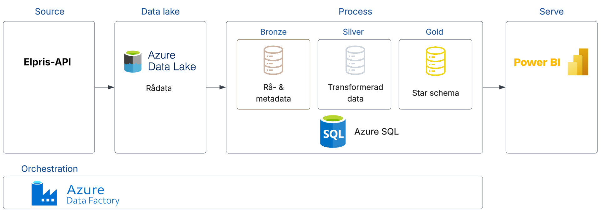
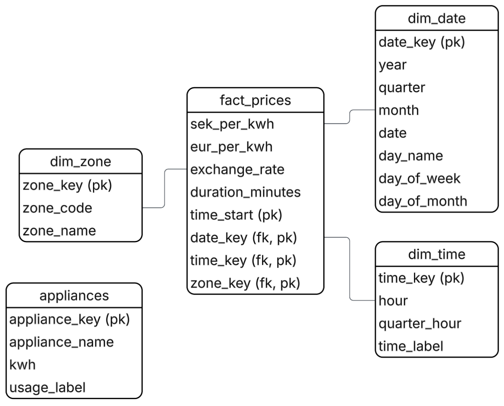
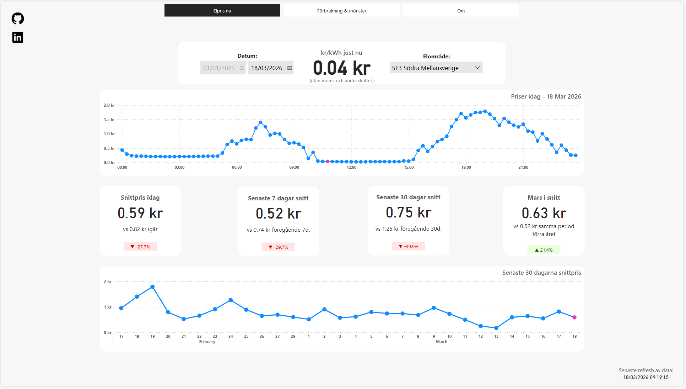
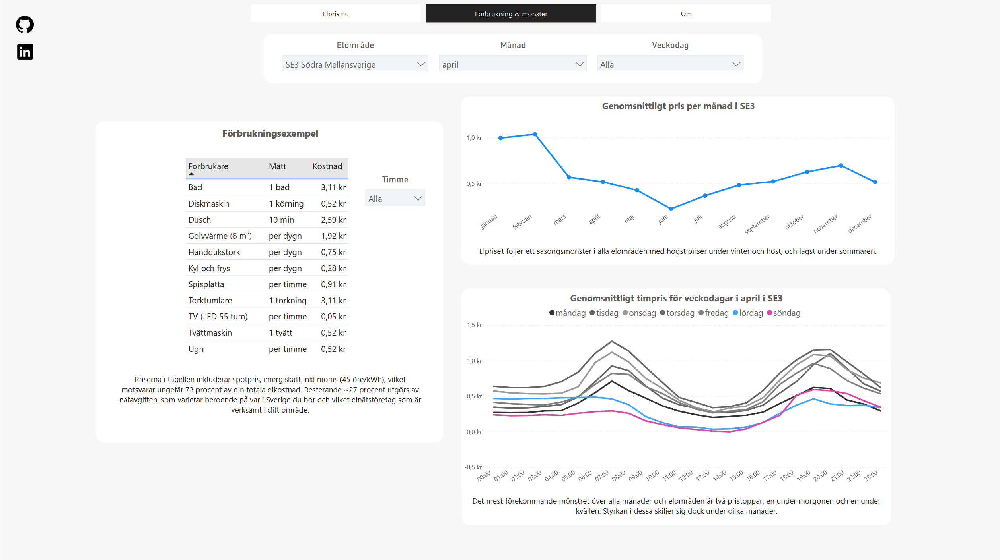
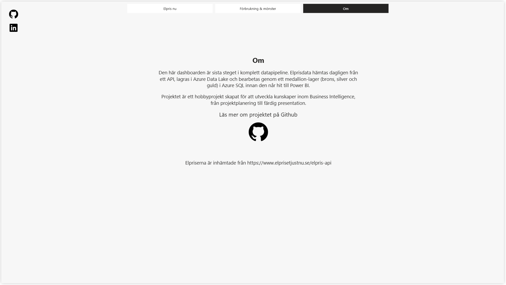

## Översikt
Detta projekt presenterar aktuella och historiska elpriser i en dashboard.  
Lösningen är byggd som en komplett pipeline enligt data engineering- och data warehousing-standards. Det är skapat som ett hobbyprojekt för utveckla kunskaper inom IT och Business Intelligence.

Pipelinen hämtar kontinuerligt elpriser från ett externt API, lagrar rådata i en datalake, bearbetar och berikar datan i SQL-lager och presenterar slutligen datan i Power BI.


## Index
- [Kravspecifikation](#Kravspecifikation)  
- [Pipeline-arkitektur](#Pipeline-arkitektur)  
	- [Source](#source)  
	- [Data Lake](#data-lake)  
	- [Data Warehouse (DW)](#Data-Warehouse-(DW))
		- [Bronze layer](#Bronze-layer)
		- [Silver layer](#Silver-layer)
		- [Gold layer](#Gold-layer)
		- [Reference Table](#Reference-Table)
	- [Serve](#Serve)  
	- [Orchestration](#Orchestration)  
	- [Orkestrering övrigt](#orkestrering-övrigt)  
- [Dataflöde](#Dataflöde)
	- [Inkrementell laddning](#inkrementell-laddning)
	- [Backfill (Historisk laddning)](#backfill-historisk-laddning)
- [Datamodell](#datamodell)
	- [Freshness](#freshness) 
	- [Grain Definition](#grain-definition)
	- [Slowly changing dimensions](#slowly-changing-dimensions) 
	- [Surrogate Key Strategy](#surrogate-key-strategy)
- [Datakvalité & Validering](#Datakvalité-&-Validering)
	- [Null Rules](#null-rules) 
	- [Uniqueness](#uniqueness) 
	- [Schema drift](#schema-drift) 
	- [Validering](#validering)
- [Driftövervakning](#Driftövervakning)
	- [Monitoring](#monitoring) 
	- [Alerts](#alerts)
- [Recovery](#Recovery)
- [Säkerhet & Dataskydd](#Säkerhet-&-Dataskydd)
- [Power BI](#Power-BI)
	- [Sida: Elpriset Nu](#sida-elpriset-nu) 
	- [Sida: Förbrukning & Mönster](#sida-förbrukning--mönster) 
	- [Sida: Om](#sida-om) 
	- [Övrigt](#övrigt)
- [Framtida utveckling](#Framtida-utveckling)
- [Lärdomar & förbättringar](#Lärdomar-&-förbättringar)

---
## Kravspecifikation
Syftet med projektet är att ta fram en interaktiv dashboard som ger en tydlig och lättillgänglig översikt över svenska elpriser. Användaren ska kunna se dagens priser, följa prisförändringar på kort och lång sikt, se mönster och jämföra med tidigare perioder samt få konkreta kostnadsexempel på saker i hemmet som konsumerar el.

**Funktionella krav:**
1. Visa nuvarande elpris
2. Visa dagens elpriser
3. Visa historiska mönster
4. Innehålla data från minst (01/01/2025)
5. Visa snittpriset för:
	- Idag kontra igår
	- Nuvarande 7 dagar kontra föregående 7 dagar
	- Nuvarande 30 dagar kontra föregående 30 dagar
	- Nuvarande månad kontra samma period månaden förra året. 
7. Visa senaste 30 dagars prisutveckling
8. Tillhandahålla filtrering av olika elområden
9. Visa exempel på kostnader
	- ex. Hur mycket kostar 1 timme tv-tittande

**Icke-funktionella krav:**
1. Elpriser ska uppdateras varje dygn
2. Gränssnittet ska vara tydligt och enkelt att navigera
3. Lösningen ska vara utbyggbar så att nya analyser och visualiseringar kan läggas till utan att befintlig struktur behöver göras om.
---
# Systemarkitektur
## Source
**Namn**: Elpris-API
**Tjänst**: https://www.elprisetjustnu.se/api
**Typ**: Rest-API
**Format**: JSON
**Frekvens**: 1 gång om dagen. Priser för morgondag uppkommer kl 13 varje dag. 
	Före 1e oktober 2025 existerade endast pris per timme.

**Upstream:** Inget, APIet är första steget i pipelinen.
**Downstream:** Data Lake

Exempeldata:
```json
{	
	"SEK_per_kWh":0.31541,
	"EUR_per_kWh":0.0286,
	"EXR":11.028405,
	"time_start":"2025-10-20T00:00:00+02:00",
	"time_end":"2025-10-20T00:15:00+02:00"
}
```
Elområde specificeras i URL https://www.elprisetjustnu.se/api/v1/prices/2025/10-23_SE3.json 
## Data Lake
**Tjänst**: Azure Data Lake (Storage Gen 2)
**Syfte**: Lagra all rådata
**Format**: JSON. Filnamn i formen 'prices_20260201_SE1.json'
**Upstream**: Elpris-API
**Downstream**: Process
## Data Warehouse (DW)
**Tjänst**: Azure SQL Server med 1 Azure SQL Database
**Syfte**: Bearbeta data genom tre lager för att få 'business ready' data med star schema-struktur, och erhålla annan relevant data, redo att skickas till Power BI.
**Format:** TSQL
**Upstream**: Data Lake
**Downstream**: Serve

**Info:** Alla script som används finns i mappen scripts här i github-projektet.
### Bronze layer
**Tabellnamn i SQL:** bronze.prices
**Syfte**: Ta emot rådata från data lake, addera metadata och göra data redo för att processas till nästa lager.
### Silver layer
**Tabellnamn i SQL:** silver.prices, silver.load_silver
**Syfte**: Tvätta, strukturera och berika data så att den är redo för att optimeras för analys.
### Gold layer
**Tabellnamn i SQL:** gold.fact_prices, gold.dim_date, gold.dim_time, gold.dim_zone, gold.load_gold
**Syfte**: Aggregera och kurera data så att den är redo att analyseras.
### Övrigt
#### Appliances
**Tabellnamn i SQL:** ref.appliances
**Syfte:** Innehåller data för apparater och dess energiförbrukning, vilket används i Power BI som exempel på elförbrukning i hemmet.
## Serve
**Tjänst**: Power BI Desktop
**Syfte**: Att tillhandhålla elpris-analyser i en dashboard.
**Upstream**: DW
**Downstream**: Inget, Power BI är sista steget. (Uppvisning av dashboarden i på hemsidan via Power BI service räknas som utanför projektet)
**Frekvens**: Dashboarden uppdateras 1 gång om dagen.
## Orchestration
**Tjänst**: Azure Data Factory
**Syfte**: Att automatisera och styra dataflödet i pipelinen
- Säkerställa att data hämtas från Elpris-API på rätt tider.  
- Styra laddning och transformering mellan Data Lake och Data Warehouse-lager.

**Info:** Mapparna dataset, factory, linkedService, pipeline och trigger här i github-projektet hör till Azure Data Factory.
## Övrig arkitektur
**Azure storage explorer** användes för mata in backfill-datan som hade hämtats med hjälp av ett lokalt exekuterat python-script.

---
# Dataflöde
## Inkrementell laddning
**Syfte:** Fyller kontinuerligt projektet med dagsfärsk data 
**Flöde:**
	1. ADF hämtar priser för dagen från Elpris-API och lagrar JSON-filer i Data Lake
	2. ADF laddar in datan från Data Lake till brons-lagret
	3. ADF kör `load_silver`. Data tvättas, berikas med `zone_code` och `duration_minutes` och läggs in i silver
	4. ADF kör `load_gold`: Data transformeras och läggs in star schema beståendes av `fact_prices`, `dim_date`, `dim_time` och `dim_zone`.
	5. Power BI refreshar datan en gång per dag och dashboarden uppdateras
## Backfill (Historisk laddning)
**Syfte:** Används för att fylla på gammal data i projektet 
**Flöde:** Historisk data från 2025-01-01 hämtades med ett lokalt Python-script och lades manuellt in i Data Lake via Azure Storage Explorer. ADF-pipelinen `pl_orchestration_backfill` orkestrerade sedan laddningen genom alla tre lager: `pl_backfill_load` laddade från Data Lake till bronze, följt av `pl_load_silver` och `pl_load_gold`. 

---
# Datamodell


## Freshness
Datamodellen uppdateras en gång om dagen, vid midnatt.
## Grain definition
En rad representerar som minst ett elpris för ett 15-minutersintervall i ett specifikt elområde, för elpriser med datum från innan oktober 2025 är det 1 timme.
## Slowly changing dimensions
Ingen SCD-strategi är implementerad eftersom det inte finns några attribut som är i risk av sån typ av förändring.
## Surrogate key strategy
Alla dimensionstabeller använder genererade ID:n som surrogatnycklar (zone_key, date_key, time_key). De används som primärnycklar i dimensionerna och som främmande nycklar i fact_prices. 

OBS. Bytet till sommartid gör dock att zone_key, date_key och time_key inte blir helt unika utan innehåller dublett, så i fact_prices används även time_start för att bilda en unik nyckel. 

---
# Datakvalité & Validering
## Null Rules 
Alla kolumner i silver och gold är definierade som `NOT NULL`. Null-värden avvisas därmed i databasen och en transaktion rullas tillbaka med `XACT_ABORT` ifall något blir fel.
## Uniqueness
I silver och guldlager är det constraints på alla nycklar så att det inte kan bli dubletter. zone_key, date_key, time_key och time_start tillsammans utgör helt unik nyckel.

## Schema drift 
Ingen strategi existerar just nu.

## Validering
**Datatyp:** Värden som inte är kompatibla med datatypen i en kolumn blir automatiskt stoppade av SQL. 

**Felaktiga men logiska värden**: Nuvarande validering sker i `load_silver` innan data transformeras och laddas. Två kontroller körs mot bronze-lagret:
- **Zonkod**: `zone_code` måste vara ett av de fyra giltiga värdena SE1–SE4. Värdet extraheras från källfilens namn.
- **Tidsintervall**: `time_end` måste vara senare än `time_start`.

Om någon kontroll misslyckas kastas ett fel med `THROW`, transaktionen rullas tillbaka och felet loggas i `silver.load_log`. Ingen data laddas in förrän valideringen passerar.

**Saknas men planeras att implementeras:**
Kontroll av förväntad mängd inladdade rader, t.ex. 384st för ett datums data.
Kontroll av suspekta eller uppenbart felaktiga värden, t.ex. onormalt höga priser, utförs inte.

---
# Övervakning
### Monitoring
**Databas:** Varje körning av `load_silver` och `load_gold` loggas i respektive loggtabell (`silver.load_log`, `gold.load_log`) med procedurnamn, antal inladdade rader, status (`SUCCESS`/`FAIL`) och eventuellt felmeddelande.

**Azure:** ADF loggar alla pipeline-körningar med status, starttid och sluttid i Azure Monitor.
### Alerts
Mail-alerts är inställt ifall triggern i ADF som kör dagliga datan skulle misslyckas.

---
# Recovery
**Strategi om pipeline misslyckas:** Det finns en pipeline för manuell inladdning av data som kan användas, om felet är i ingestion eller bronslager. Om fel data existerar i silver eller guldlager behöver datan först tas bort där ifrån vilket inga färdiga script existerar för. Datan kan inte uppdateras genom att köra någon av de existerande pipeline-aktiviteterna som för data lake och bronslager.

**Disaster recovery:** 
- Data Lake storage i Azure har redundancy inställt så att om inte båda områdena går ner så ska datan finnas tillgänglig ändå. 
- Det finns ingen backup för databasen. I Azure SQL Database finns möjligheten, men för att spara pengar i student-kontot har dessa inte gjorts. Om data lake är intakt kan data fyllas på där ifrån och ersätta tappad data.
- Versionshantering finns för allt i Azure Data Factory och alla scripts som körs i SQL, så ADF-aktiviter och SQL-kod ska alltid kunna återskapas. 
- Power BI-dokumentet existerar i Power BI service och lokalt sparat, om en fallerar så finns en kvar.

---
## Säkerhet & Dataskydd
- Känsliga uppgifter som databasanvändarnamn, lösenord och anslutningar lagras i Azure Key Vault och refereras därifrån i ADF. Inga credentials är hårdkodade i pipelines eller scripts. 
- Projektet hanterar inga personuppgifter. All data är aggregerade elpriser från ett publikt och öppet API.

---
# Power BI

## Sida: Elpriset Nu

Bild från 18/03/2026.
**Nuvarande elpris:** För att uppnå funktionaliteten att olika värden visas utifrån deras nuläge så används DAX-funktionen NOW(), men om man också vill kunna ändra datum så uppstår det problem. Säg att vi vill kolla elpris utifrån gårdagen, då behöver vi använda ett slags ankar-datum. `VAR anchor_date = MAX(dim_date[date])`. Ankar-datumet tillsammans med MAX gör att vi kan få senaste datumet i slicer i Power BI och på så sätt lösa problemet. Exempel på detta är DAX-koden current_price här i repo:t.

**swedish-offset, eller; varför är tiden en eller två timmar fel i Power BI Desktop?:** Dashboarden utvecklas i Power BI Desktop, men laddas upp till Power BI Service för att kunna bäddas in på en hemsida. I Service är UTC den enda tidsinställningen som existerar, vilket gör att vi måste plussa på antingen en eller två timmar beroende på sommar/vintertid. Detta görs genom DAX-måttet swedish-offset som används som variabel i andra mått.

## Sida: Förbrukning & Mönster

Bild från 18/03/2026.
## Sida: Om

Bild från 18/03/2026.
## Övrigt
- Rapporten använder en färgtabell där alla färger finns som värden, detta görs att få dynamiska färger som kan ändras via filter, t.ex. för framtida implementation av darkmode-läge.

**Darkmode-läge:** Slicers och textrutor har inte FX, vilket gör att färgen hos dem inte kan dynamiskt uppdateras. Ikoner har inte heller FX, men kan uppdateras genom att man har SVG-kod som variabel och dynamiskt ändrar färgvärdet. 

---
# Framtida utveckling
1. Kontroll av förväntad mängd inladdade rader, t.ex. 384st för ett datums data.
2. Automatiserad kontroll av suspekta eller uppenbart felaktiga värden, t.ex. onormalt höga priser.
3. Ta fram strategi för hur felaktiga värden ska ersättas i pipelinen och något skulle gå fel.
4. Kontrollera att bronslagret i SQL bara innehåller 3 dagars data och att proceduren för detta inte misslyckats på något sätt. 

**Kanske:**
- En sida som presenterar el-året 2025. Högsta topparna och lägsta dalarna i pris och andra analyser. Hade dock velat ha data för tidigare år att jämföra emot.
- Att göra Förbrukning & Mönster till en storytelling-sida där man tydligare går igenom olika saker som påverkar elkostnader, som en artikel om vad som kan hjälpa en individ sänka elkostnader.
---
# Lärdomar & förbättringar
**Planering:**
- Skapa en mer tydlig vision för dashboarden i planering, vad är syftet, vilken är målgruppen?
- Pilottesta mer. Generera testdata för det planerade star schemat, ta in det i Power BI och utforska möjliga brister och behov.
- Undersök noga vilka de olika alternativen för infrastruktur är och dokumentera kort de olika valen.

**Naming convention:** Kolla vilka naming conventions som är standard för de olika verktygen, och FÖLJ STRIKT sedan bestämda naming conventions.

**Azure/molnplattformar:**
- Sätt upp budget alert så snart som möjligt
- Kolla vilka kostnader varje resurs som planeras att användas har, och möjliga kostnadsfällor.

 **Dokumentation:**
 - Notion är bra för att checka av när större uppgifter är klara för en hel översikt, men kolla upp ticketsystem eller liknande, så att mindre uppgifter kan kommenteras kort och spåras bättre.
 - Var noggrann med att alltid skriva kommentarer/dokumentation utifrån tanken att andra personer ska kunna förstå det.
 - Undersök om numrering av scripts i form av 01_init_database.sql, 02_DDL_bronze är en värd konvention att följa.

**Arkitektur:**
- Pipelinen har nu en Data lake och ett bronslager i SQL vilket är lite av en dublering. Alternativ 1: Kalla Data Lake för bronslager och ändra bronze.prices som en landningstabell, för det är egentligen vad det är i nuvarande design. Ifall databasen skulle råka utför problem är detta ett säkrare alternativ än alternativ 2.
- Alternativ 2: Skippa Data lake storage helt och kopiera in data direkt i SQL, och ha bronslagret som rådata-lager.

**Felhantering och validering:**
- Validera datakvalité för upptäcka suspekta eller uppenbart felaktiga värden direkt i inhämtning från APIet, onödigt att låta senare processer köras om man redan från början kan fånga fel.
- Läs tydligt på om vanliga mönster inom felhantering och validering innan saker byggs.

**Åtgärda fel:**
- Skapa scripts för att enkelt ta bort och uppdatera data, så ifall något blir fel är de redan klara. 

**Power BI:**
- När det är 0,001kr i dashboarden så kanske det är bättre att ändra så att det blir öre? 
